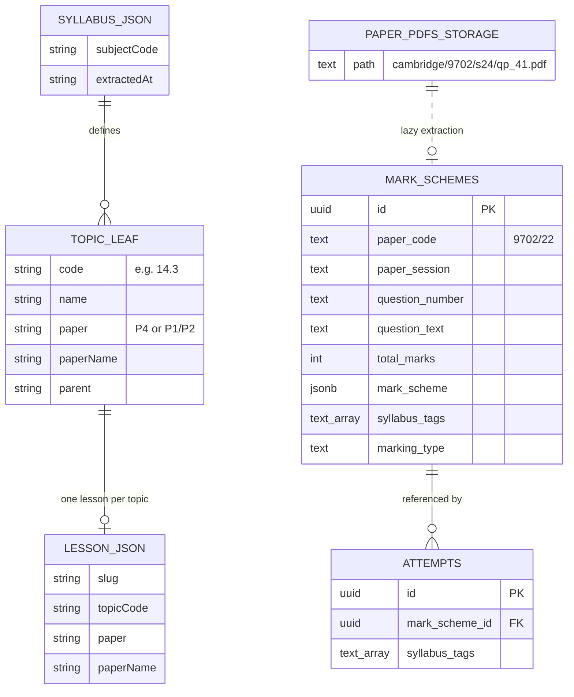

# Content Pipeline Schema Audit (Phase 0)

**Date:** 2026-06-06  
**Project:** `mcnqxokprggjadtlloyr` (hamzagul07's Project)  
**Scope:** Paper-scoped content regeneration pipeline (Prompt B v2)  
**Verdict:** **BLOCKED — do not proceed to Phases 1–5 until data layer gaps are fixed**

---

## Executive summary

The paper-scoped pipeline assumes Supabase holds authoritative, filterable data for **(subject, paper, topic)** tuples: syllabus objectives, topic-to-paper mappings, past-paper questions per paper, and paired mark schemes.

**What exists today:**

| Layer | Location | Paper-scoped? | Usable for generation? |
|-------|----------|---------------|------------------------|
| Past-paper questions + mark schemes | `mark_schemes` (Supabase) | Partially (via `paper_code` parsing) | **No** — 93 rows total; 92% untagged; 9702 has only Paper 2 |
| Syllabus topics | `lib/syllabi/*.json` (repo) | Partially (`paper` string per topic) | **Partial** — topic names only, no numbered objectives |
| Paper metadata (type, duration, marks) | `lib/marking/component-types.ts` (repo) | Yes (marking style per component) | **Partial** — no duration/total marks |
| Lesson content | `content/courses/{code}/*.json` | One lesson per topic, not per paper | **No** — not paper-scoped |

**Critical blockers:**

1. **No Paper 4 (or P1/P3/P5) questions for 9702 in Supabase** — the pilot tuple `(9702, Paper 4, Topic 14.3)` returns zero rows.
2. **`syllabus_tags` coverage is 7.5%** — topic filtering is unreliable; 28/29 Physics questions are untagged.
3. **Syllabus objectives are not in the database** — only leaf topic codes (`14.3`) with titles; no `14.3.1`-style bullet objectives.
4. **Topic-to-paper mapping is not a many-to-many** — topics use combined strings like `"P1/P2"`; same topic cannot cleanly produce separate P1 and P2 lessons from one row.
5. **No `papers` or `subjects` tables** — paper identity is embedded in `paper_code` (`9702/22`).

Per Prompt B v2: *"If the schema doesn't cleanly support filter by paper — stop and report."* Paper filtering is **mechanically possible** on `paper_code`, but the **data and relationships are not clean enough** to run hallucination-free, paper-scoped generation.

---

## 1. Public schema — table inventory

| Table | PK | Row count | Relevance to pipeline |
|-------|-----|-----------|----------------------|
| `mark_schemes` | `id` (uuid) | **93** | **Primary** — questions + mark schemes + topic tags |
| `attempts` | `id` | 76 | FK → `mark_schemes.id`; student marking history |
| `signups` | `id` | 7 | Marketing — not relevant |
| `user_profiles` | `id` | 10 | Auth — not relevant |
| `user_subscriptions` | `id` | 17 | Billing — not relevant |
| `user_credits` | `user_id` | 17 | Billing — not relevant |
| `usage_events` | `id` | 35 | Billing — not relevant |
| `pricing_config` | `id` | 153 | Billing — not relevant |
| `rate_limits` | `id` | 16 | Rate limiting — not relevant |
| `classrooms` | `id` | 1 | Teacher — not relevant |
| `classroom_memberships` | `(classroom_id, student_id)` | 1 | Teacher — not relevant |
| `teacher_overrides` | `id` | 0 | Teacher — not relevant |
| `intervention_tests` | `id` | 0 | Teacher — not relevant |
| `shadow_enforcement_log` | `id` | 6 | Billing — not relevant |
| `contact_messages` | `id` | 0 | Support — not relevant |
| `stripe_webhook_events` | `id` | 0 | Billing — not relevant |

**Tables that do NOT exist (but the pipeline expects):**

- `subjects`
- `papers`
- `syllabus_topics`
- `syllabus_objectives`
- `topic_papers` (many-to-many)
- `past_paper_questions` (separate from mark schemes)
- `mark_scheme_points` (normalised; today embedded in JSONB)

---

## 2. `mark_schemes` — the only content-authoritative table

### Columns

| Column | Type | Notes |
|--------|------|-------|
| `id` | uuid | Question identity for FKs and `sourceQuestionId` |
| `board` | text | Default `Cambridge International` |
| `subject` | text | Human name (`Physics`, `Mathematics`) — **not normalised** (also `Mathematics 9709`) |
| `paper_code` | text | Format `{subjectCode}/{component}` e.g. `9702/22`, `9709/12` |
| `paper_session` | text | e.g. `May/June 2024` — **not normalised** to `s24` codes used elsewhere |
| `question_number` | text | e.g. `1(b)(i)` |
| `question_text` | text | Full question stem |
| `total_marks` | int4 | Total marks for sub-question |
| `mark_scheme` | jsonb | Structured marking data (see below) |
| `syllabus_tags` | text[] | Topic codes e.g. `["7.1"]` — **sparse** |
| `marking_type` | text | `mcq \| point_based \| level_of_response \| mixed` |
| `created_at` | timestamptz | Ingestion timestamp |

### Constraints

- **PK:** `id`
- **UNIQUE:** `(paper_code, paper_session, question_number)` — named `unique_question`
- **FK inbound:** `attempts.mark_scheme_id → mark_schemes.id`

### `mark_scheme` JSONB shape (observed)

```json
{
  "type": "point_based",
  "marks": [
    { "id": 1, "type": "C1", "value": 1, "description": "I = P/A", "acceptable_forms": [] },
    { "id": 2, "type": "C1", "value": 1, "description": "= 750 / (1300 × 10^-3)^2", "acceptable_forms": [] },
    { "id": 3, "type": "A1", "value": 1, "description": "= 440 W m^-2", "acceptable_forms": ["440"] }
  ],
  "notes": "",
  "common_errors": [],
  "acceptable_final_answers": ["440"]
}
```

Mark schemes are **co-located with questions** in one row — there is no separate `mark_schemes` / `questions` pairing table.

### Paper number extraction

Cambridge component codes encode paper number in the first digit:

| `paper_code` | Component | Paper number | Variant |
|--------------|-----------|--------------|---------|
| `9702/11` | `11` | **1** | Paper 1 variant 1 |
| `9702/22` | `22` | **2** | Paper 2 variant 2 |
| `9702/41` | `41` | **4** | Paper 4 variant 1 |

Existing helper: `paperFromComponent()` in `lib/marking/component-types.ts`:

```ts
function paperFromComponent(component: string): number {
  const n = parseInt(component, 10)
  if (Number.isNaN(n)) return 0
  return n >= 10 ? Math.floor(n / 10) : n
}
```

SQL equivalent used in audit queries:

```sql
LEFT(split_part(paper_code, '/', 2), 1) AS paper_number
```

---

## 3. Data coverage — what is actually in the database

### By subject and paper number

| Subject code | Paper # | `paper_code` values | Question count |
|--------------|---------|---------------------|----------------|
| 9489 | 2 | `9489/22` | 18 |
| 9701 | 2 | `9701/22` | 2 |
| **9702** | **2** | **`9702/22` only** | **29** |
| 9706 | 2 | `9706/22` | 1 |
| 9708 | 2 | `9708/22` | 9 |
| 9709 | 1 | `9709/11`, `9709/12` | 34 |

**9702 has zero rows for Papers 1, 3, 4, or 5.**

### Syllabus tag coverage

| Metric | Value |
|--------|-------|
| Total questions | 93 |
| With ≥1 `syllabus_tags` | **7** (7.5%) |
| Untagged | **86** (92.5%) |

Tagged tags in DB: `1.1`, `1.2`, `1.6`, `2.2.3`, `2.2.4`, `7.1`, `9.1` — all from 9709/9702, none at A-Level depth codes like `14.3`.

### Sessions represented

- `May/June 2020`
- `May/June 2024`
- `May/June 2025`

9702 data is **one paper, one session** (`9702/22`, May/June 2024).

### PDF source (not yet extracted)

Past-paper PDFs live in Supabase Storage bucket `paper-pdfs`:

```
cambridge/{subjectCode}/{sessionCode}/{qp|ms}_{component}.pdf
```

The marking pipeline can **lazy-extract** questions from PDFs into `mark_schemes` on first use (`lib/marking/storage-extract.ts`). The content pipeline could theoretically trigger bulk pre-warm (`scripts/prewarm-mark-schemes.mjs`), but **that data is not pre-populated today**.

---

## 4. Syllabus data — repo JSON, not Supabase

### Location

- `lib/syllabi/{subjectCode}.json` — extracted from syllabus PDFs via `scripts/extract-syllabi.mjs`
- `lib/syllabus.ts` — 9709 Mathematics (separate structure)

### Structure (9702 example)

```json
{
  "subjectCode": "9702",
  "subjectName": "Physics",
  "parents": [
    { "code": "14", "name": "Temperature", "paper": "P4", "paperName": "Paper 4: A Level Structured Questions" }
  ],
  "topics": [
    {
      "code": "14.3",
      "name": "Specific heat capacity and specific latent heat",
      "paper": "P4",
      "paperName": "Paper 4: A Level Structured Questions",
      "parent": "14"
    }
  ]
}
```

### Gaps vs pipeline `SyllabusObjective` type

| Pipeline expects | What exists |
|------------------|-------------|
| `topicCode: "14.3"` | ✅ `code` field on leaf topics |
| `number: "14.3.1"` (numbered bullets) | ❌ Not extracted — leaves are sub-topic headings only |
| `text` (exact syllabus wording) | ❌ Only `name` (short title) |
| `examinedInPapers: ["1","2","4"]` | ❌ Single `paper` string; often `"P1/P2"` combined |
| `skills` (command words) | ❌ Not stored |

### Topic-to-paper mapping (9702)

| `paper` value | Topic count (approx.) | Notes |
|---------------|----------------------|-------|
| `P1/P2` | ~37 topics | AS content — **same lesson would need to split into P1 + P2** |
| `P4` | ~39 topics | A Level structured — no P3/P5 entries in syllabus JSON |

**No topic in `lib/syllabi/9702.json` is tagged `P3` or `P5`.** Practical/planning papers are absent from the extracted syllabus tree.

---

## 5. Lesson JSON files — current course structure

### Path pattern (today)

```
content/courses/9702/{slug}.json
```

One file per **topic**, not per **(topic, paper)**.

### Identity fields (observed)

```json
{
  "slug": "14-3-specific-heat-capacity-and-specific-latent-heat",
  "topicCode": "14.3",
  "title": "Specific heat capacity and specific latent heat",
  "paper": "P4",
  "paperName": "Paper 4: A Level Structured Questions"
}
```

| Field | Present? | Notes |
|-------|----------|-------|
| `paperNumber` (pipeline schema) | ❌ | Uses `paper: "P4"` or `"P1/P2"` |
| `paperType` | ❌ | Not in lesson JSON |
| `sourceQuestionId` on worked examples | ❌ | No traceability to DB |
| `pastPaperReferences` | ❌ | Fetched at render time via `fetchPastPaperQuestionsForTopic()` — **not paper-filtered** |

### 9702 lesson distribution

| `paper` field | Lesson files |
|---------------|--------------|
| `P1/P2` | ~37 |
| `P4` | ~39 |

Lessons labelled `P1/P2` are **not** separate Paper 1 and Paper 2 variants — they are a single combined lesson per topic.

### Current past-paper fetch (not paper-scoped)

From `lib/courses/past-paper-questions.ts`:

```ts
.from('mark_schemes')
.like('paper_code', `${subjectCode}%`)      // any paper for subject
.contains('syllabus_tags', [topicCode])      // topic filter only
```

**No `paper_number` filter** — a Paper 4 lesson could surface Paper 2 questions.

---

## 6. Relationship diagram



**Missing relationships (pipeline needs):**

- `TOPIC_LEAF }o--o{ PAPER` — many-to-many (which papers examine which topics)
- `SYLLABUS_OBJECTIVE }|--|| TOPIC_LEAF` — numbered bullet objectives
- `MARK_SCHEMES }|--|| PAPER` — explicit FK, not string parsing

---

## 7. Example queries — tuple `(9702, Paper 4, Topic 14.3)`

### 7a. Syllabus objectives for Topic 14.3

**Source:** `lib/syllabi/9702.json` (not SQL)

```ts
import s9702 from '@/lib/syllabi/9702.json'
const topic = s9702.topics.find(t => t.code === '14.3')
// { code: "14.3", name: "Specific heat capacity...", paper: "P4", ... }
```

**Result:** Topic exists, assigned to Paper 4 only. No `14.3.1`, `14.3.2` bullet objectives.

### 7b. Confirm Topic 14.3 is examined on Paper 4

**Source:** syllabus JSON `paper` field

```ts
topic.paper === 'P4'  // true
topic.paper.includes('4')  // true
```

**Cannot confirm via Supabase** — no `topic_papers` table. Cannot confirm Paper 1 also tests this topic (it does not per syllabus JSON).

### 7c. Past-paper questions from Paper 4 tagged with Topic 14.3

```sql
SELECT
  ms.id,
  ms.paper_code,
  ms.paper_session,
  ms.question_number,
  ms.question_text,
  ms.total_marks,
  ms.syllabus_tags,
  ms.marking_type
FROM mark_schemes ms
WHERE split_part(ms.paper_code, '/', 1) = '9702'
  AND LEFT(split_part(ms.paper_code, '/', 2), 1) = '4'   -- Paper 4
  AND ms.syllabus_tags @> ARRAY['14.3']::text[];
```

**Result: 0 rows**

Broader check — any Paper 4 question for 9702 regardless of topic:

```sql
SELECT COUNT(*) FROM mark_schemes
WHERE split_part(paper_code, '/', 1) = '9702'
  AND LEFT(split_part(paper_code, '/', 2), 1) = '4';
```

**Result: 0 rows**

### 7d. Mark schemes for those questions

Since 7c returns nothing, mark schemes are also unavailable. When questions exist, mark scheme data is in the same row:

```sql
SELECT
  ms.id AS question_id,
  ms.paper_code,
  ms.mark_scheme->'marks' AS points_awarded,
  ms.mark_scheme->'notes' AS examiner_notes,
  ms.mark_scheme->'common_errors' AS common_errors
FROM mark_schemes ms
WHERE ms.id = :question_id;
```

### 7e. Worked comparison — tuple that *does* return data

`(9702, Paper 2, Topic 7.1)` — the only tagged 9702 question in the database:

```sql
SELECT ms.id, ms.paper_code, ms.paper_session, ms.question_number,
       ms.total_marks, ms.syllabus_tags, ms.marking_type
FROM mark_schemes ms
WHERE split_part(ms.paper_code, '/', 1) = '9702'
  AND LEFT(split_part(ms.paper_code, '/', 2), 1) = '2'
  AND ms.syllabus_tags @> ARRAY['7.1']::text[];
```

| id | paper_code | session | question | marks | tags |
|----|------------|---------|----------|-------|------|
| `be83ced1-...` | `9702/22` | May/June 2024 | `1(b)(i)` | 3 | `["7.1"]` |

Even this working tuple has **one question** — insufficient for multi worked-example generation.

### 7f. Paper-scope integrity test (leakage check)

Fetch Paper 4 evidence — must return zero Paper 2 rows:

```sql
-- Simulated getLessonEvidence(9702, '4', '14.3') question pool
SELECT id, paper_code
FROM mark_schemes
WHERE split_part(paper_code, '/', 1) = '9702'
  AND LEFT(split_part(paper_code, '/', 2), 1) = '4'
  AND syllabus_tags @> ARRAY['14.3']::text[];

-- Leakage check: should be 0 rows where paper_number != '4'
SELECT COUNT(*) AS leaked
FROM mark_schemes
WHERE split_part(paper_code, '/', 1) = '9702'
  AND syllabus_tags @> ARRAY['14.3']::text[]
  AND LEFT(split_part(paper_code, '/', 2), 1) != '4';
```

**Result:** Empty pool; no leakage (because there is no data at all).

---

## 8. Pilot lesson feasibility (Phase 5 tuples)

| Pilot tuple | Syllabus in JSON? | Questions in DB? | Verdict |
|-------------|-------------------|------------------|---------|
| 9702 P1 Topic 3.1 | ✅ `P1/P2` | ❌ No P1 rows | **Blocked** |
| 9702 P2 Topic 7.2 | ✅ `P1/P2` | ❌ No tagged 7.2 rows | **Blocked** |
| 9702 P3 Topic 1.2 | ⚠️ Not in syllabus JSON as P3 | ❌ No P3 rows | **Blocked** |
| 9702 P4 Topic 14.3 | ✅ `P4` | ❌ No P4 rows | **Blocked** |
| 9702 P5 Topic 14.2 | ⚠️ Not in syllabus JSON as P5 | ❌ No P5 rows | **Blocked** |

The only viable 9702 evidence today is **untagged Paper 2 questions** (29 rows, one session) — unusable for topic-scoped, paper-scoped generation without re-tagging and massive ingestion.

---

## 9. Recommended fixes (before Phase 1)

Ordered by dependency. **Stop here until these are addressed and re-audited.**

### Priority 1 — Ingest past-paper corpus

1. **Bulk pre-warm `mark_schemes`** from `paper-pdfs` storage for 9702 Papers 1, 2, 3, 4, 5 across multiple sessions (≥5 years where available).
2. Target: **≥10 questions per (paper, topic)** for pilot topics; **≥3** minimum before generation (per risk register).
3. Normalise `paper_session` to canonical codes (`s24`, `w23`) alongside display labels.

### Priority 2 — Syllabus tagging

1. Run syllabus tag enrichment on all ingested questions (marking pipeline already tags on mark — extend to bulk backfill).
2. Validate tags against `lib/syllabi/{code}.json` leaf codes.
3. Add CI check: `% tagged ≥ 95%` per subject before generation.

### Priority 3 — Syllabus objectives in queryable form

Options (pick one):

- **A.** New Supabase tables `syllabus_objectives`, `topic_papers` populated from syllabus PDFs at fine-grain (`14.3.1` bullets).
- **B.** Extend `lib/syllabi/*.json` with `objectives[]` per leaf and load from repo (faster, no migration).

Either way, `getSyllabusObjectives()` needs numbered bullet text, not just topic titles.

### Priority 4 — Topic-to-paper many-to-many

Replace `"P1/P2"` combined strings with:

```ts
examinedInPapers: ['1', '2']  // per topic or per objective
```

Required so `getTopicsForPaper('9702', '1')` and `getTopicsForPaper('9702', '2')` return distinct topic lists.

### Priority 5 — Optional normalisation (quality of life)

| Addition | Purpose |
|----------|---------|
| `papers` table | `subject_code`, `paper_number`, `paper_type`, `level`, `duration_min`, `total_marks` |
| `paper_number` generated column on `mark_schemes` | Avoid repeated `split_part` parsing |
| Consistent `subject` column | Always `9702`, not `Physics` |

---

## 10. What can proceed without blocking (limited)

If fixes are staged:

| Work | Can start? | Condition |
|------|------------|-----------|
| `GeneratedLesson` TypeScript types | ✅ | Repo-only |
| `lesson-prompt.ts` template | ✅ | Repo-only |
| Zod validator | ✅ | Repo-only |
| `content-source.ts` query layer | ⚠️ | Implement against current `mark_schemes` + syllabus JSON; mark as incomplete |
| Unit tests for `getLessonEvidence` | ⚠️ | Will fail or skip until data exists |
| Pilot generation (Phase 5) | ❌ | After Priority 1–3 |
| URL migration `/paper-{n}/` | ❌ | After lesson files exist per paper |

---

## 11. Audit conclusion

**Paper filtering is not cleanly supported end-to-end.**

- **Mechanism exists:** `paper_code` → paper number via component parsing.
- **Data does not exist:** 9702 Paper 4 (and P1/P3/P5) have zero ingested questions.
- **Relationships are incomplete:** syllabus off-DB, tags sparse, no objective bullets, no topic↔paper M:N.
- **Lessons are not paper-scoped:** one JSON per topic with combined `P1/P2` labels.

**Recommendation:** Fix Priority 1–3, re-run this audit, then seek approval to begin Phase 1.

---

## Appendix A — `mark_schemes` full column DDL (from live schema)

```sql
-- Observed via information_schema / Supabase MCP list_tables(verbose=true)
CREATE TABLE mark_schemes (
  id uuid PRIMARY KEY DEFAULT gen_random_uuid(),
  board text NOT NULL DEFAULT 'Cambridge International',
  subject text NOT NULL DEFAULT 'Mathematics',
  paper_code text NOT NULL,
  paper_session text NOT NULL,
  question_number text NOT NULL,
  question_text text NOT NULL,
  total_marks integer NOT NULL,
  mark_scheme jsonb NOT NULL,
  created_at timestamptz DEFAULT now(),
  syllabus_tags text[] DEFAULT ARRAY[]::text[],
  marking_type text,  -- mcq | point_based | level_of_response | mixed
  UNIQUE (paper_code, paper_session, question_number)
);
```

## Appendix B — Existing code references

| File | Relevance |
|------|-----------|
| `lib/courses/past-paper-questions.ts` | Current topic fetch — **no paper filter** |
| `lib/marking/component-types.ts` | Paper number + marking style heuristics |
| `lib/syllabi/index.ts` | Syllabus registry API |
| `lib/syllabi/9702.json` | 9702 topic tree |
| `lib/marking/storage-extract.ts` | Lazy PDF → `mark_schemes` extraction |
| `scripts/prewarm-mark-schemes.mjs` | Bulk ingestion script (needs running) |
| `MARKING_ARCHITECTURE.md` | Storage paths + pipeline overview |
